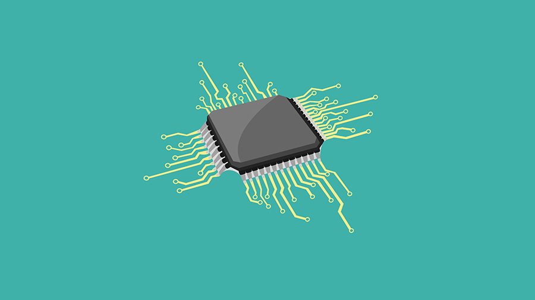

# Embedded_System_Basics

## 1. Microcontrollers vs. Microprocessors

| Feature | Microcontroller | Microprocessor |
|---------|-----------------|-----------------|
| Definition | Single-chip computer with integrated CPU, memory, and I/O | Central processing unit requiring external components |
| Memory | Limited on-chip memory (typically KB to MB range) | Supports large external memory (GB range) |
| Speed | Lower clock speeds (typically up to 200 MHz) | Higher clock speeds (GHz range) |
| Power Consumption | Lower, with power-saving modes | Higher, generally lacks power-saving modes |
| Integration | CPU, memory, and peripherals on a single chip | CPU only, requires external components |
| Cost | Generally less expensive | More expensive |
| Typical Applications | Embedded systems, IoT devices, appliances | Personal computers, servers, complex systems |
| Programming | Often C or Assembly, limited instruction set | Various languages, complex instruction set |
| Operating System | Real-time operating systems (RTOS) | Full-featured OS (e.g., Windows, Linux) |
| Flexibility | Optimized for specific tasks | Highly versatile for various applications |
| Start-up Time | Faster due to on-chip program | Slower, loads program from external memory |

## 2. Understanding Arduino

### Understanding pins

| Board             | Total Pins (Digital + Analog + Power) |
|------------------|----------------------------------|
| **Arduino Mega 2560** | 70 (54 Digital + 16 Analog) + Power Pins |
| **Arduino Nano**       | 30 (22 Digital + 8 Analog) + Power Pins |
| **Arduino Uno**        | 32 (20 Digital + 6 Analog) + Power Pins |

#### Digital Pins (D0-D13)
- General-purpose input/output (GPIO) pins
- Can be configured as either input or output using pinMode()
- When set as OUTPUT, they can be set HIGH (5V) or LOW (0V)
- When set as INPUT, they can read digital signals (HIGH or LOW)
- Some digital pins have additional functions:
  - PWM (~3, ~5, ~6, ~9, ~10, ~11): Can generate analog-like output using analogWrite()
  - RX (D0) and TX (D1): Used for serial communication

#### Analog Pins (A0-A5)
- Primarily used for reading analog signals
- Have 10-bit resolution (0-1023 range)
- Can also function as digital I/O pins when necessary
- Some analog pins have additional functions:
  - A4 (SDA) and A5 (SCL): Used for I2C communication

#### Power Pins
- VIN: Input voltage pin for external power source
- 5V: Supplies regulated 5V output
- 3.3V: Supplies regulated 3.3V output
- GND: Ground pins for completing circuits

#### Special Function Pins
- AREF: Analog reference pin for providing external voltage reference
- RESET: Pin to reset the microcontroller
- IOREF: Provides the voltage reference for the board's operation

#### Communication Pins
- I2C: SDA (A4) and SCL (A5) for I2C communication
- SPI: MOSI (D11), MISO (D12), SCK (D13), and SS (D10) for SPI communication

### Understanding Board

Arduino Nano, Mega, and Uno share several common features:
1. Operating Voltage: All three boards operate at 5V.
2. Clock Speed: They all have a 16 MHz clock frequency.
3. Programming Interface: Each board has a built-in USB interface for easy programming and code upload.
4. Microcontroller Family: They all use ATmega microcontrollers, although the specific models differ.
5. Digital I/O Pins: All three boards have digital input/output pins that can be used as input or output using pinMode(), digitalWrite(), and digitalRead() functions.
6. Analog Input Pins: Each board includes analog input pins, though the number varies.
7. PWM Capability: All three boards offer PWM (Pulse Width Modulation) output on some of their digital pins.
8. Memory Types: They all have Flash memory, SRAM, and EEPROM, although the capacities differ.
9. Power Supply Options: All can be powered via USB or an external power supply.
10. Communication Protocols: They all support serial communication protocols like SPI and I2C (TWI).
11. ICSP Header: Each board includes an ICSP (In-Circuit Serial Programming) header.
12. Reset Button: All three boards feature a reset button.
13. Arduino IDE Compatibility: They can all be programmed using the Arduino Integrated Development Environment (IDE).

| Feature | Arduino Nano | Arduino Mega | Arduino Uno |
|---------|--------------|--------------|-------------|
| Microcontroller | ATmega328P | ATmega2560 | ATmega328P |
| Operating Voltage | 5V | 5V | 5V |
| Input Voltage (recommended) | 7-12V | 7-12V | 7-12V |
| Input Voltage (limits) | 6-20V | 6-20V | 6-20V |
| Digital I/O Pins | 22 | 54 (of which 15 provide PWM) | 14 (of which 6 provide PWM) |
| Analog Input Pins | 8 | 16 | 6 |
| DC Current per I/O Pin | 40 mA | 20 mA | 20 mA |
| Flash Memory | 32 KB (ATmega328P) of which 2 KB used by bootloader | 256 KB of which 8 KB used by bootloader | 32 KB (ATmega328P) of which 0.5 KB used by bootloader |
| SRAM | 2 KB (ATmega328P) | 8 KB | 2 KB |
| EEPROM | 1 KB (ATmega328P) | 4 KB | 1 KB |
| Clock Speed | 16 MHz | 16 MHz | 16 MHz |
| Length | 45 mm | 101.52 mm | 68.6 mm |
| Width | 18 mm | 53.3 mm | 53.4 mm |
| Weight | 7 g | 37 g | 25 g |
| USB Connector | Mini-B | Standard | Standard |
| ICSP Header | Yes | Yes | Yes |
| Power LED | Yes | Yes | Yes |
| RX/TX LEDs | Yes | Yes | Yes |
| PWM Pins | 6 | 15 | 6 |
| External Interrupts | 2 | 6 | 2 |
| UART | 1 | 4 | 1 |
| SPI | 1 | 1 | 1 |
| I2C | 1 | 1 | 1 |

## 3. Communication Protocols on Arduino

### 1. I2C (Inter-Integrated Circuit)

Inter-Integrated Circuit (I2C) Protocol

I2C is a widely used serial communication protocol in embedded systems and electronics for short-distance communication between integrated circuits. It was developed by Philips Semiconductors (now NXP Semiconductors) in the early 1980s.

#### Key Features
- Uses only two wires: SDA (Serial Data) and SCL (Serial Clock).
- Multi-master, multi-slave capability.
- 7-bit or 10-bit addressing, supporting up to 128 or 1024 unique device addresses.
- Half-duplex communication.
- Supports various speed modes:
  - Standard Mode: 100 kbit/s
  - Fast Mode: 400 kbit/s
  - Fast Mode Plus: 1 Mbit/s
  - High Speed Mode: 3.4 Mbit/s
- Clock stretching for slow slave devices.
- Built-in arbitration for multi-master systems.

#### How I2C Works
1. Start Condition: The master initiates communication by sending a start condition.
2. Address Frame: The master sends the 7-bit or 10-bit address of the target slave device.
3. Read/Write Bit: Specifies whether the master wants to read from or write to the slave.
4. ACK/NACK: The slave acknowledges (ACK) if the address matches.
5. Data Frames: 8-bit data packets are sent, each followed by an ACK/NACK bit.
6. Stop Condition: The master sends a stop condition to end the communication.

### 2. UART (Universal Asynchronous Receiver-Transmitter)

UART is a widely used serial communication protocol that enables data transmission between devices without a shared clock signal. It is one of the simplest and most versatile communication methods, commonly used in Arduino boards to interact with computers and other devices.

#### Key Features of UART
- Asynchronous communication (no shared clock)
- Uses only two wires for data transmission (TX and RX)
- Configurable data format and transmission speed
- Supported on all Arduino boards

#### How UART Works

UART communication involves the following components:
1. Start bit: Signals the beginning of data transmission
2. Data bits: 5-9 bits containing the actual information
3. Parity bit (optional): Used for error checking
4. Stop bit(s): Marks the end of data transmission

### 3. SPI (Serial Peripheral Interface)

Serial Peripheral Interface (SPI) is a synchronous serial communication protocol used for short-distance communication between microcontrollers and peripheral devices.

#### How SPI Works

SPI uses a controller-peripheral architecture with four main signals:
- SCLK (Serial Clock): Generated by the controller to synchronise data transmission.
- PICO (Peripheral In, Controller Out): Data line from controller to peripheral.
- POCI (Peripheral Out, Controller In): Data line from peripheral to controller.
- CS (Chip Select): Enables/disables communication with a specific peripheral.

The controller initiates communication by pulling the CS line low for the desired peripheral. Data is then transmitted synchronously with the clock signal, allowing for full-duplex communication.

#### Key Features
- Full-duplex communication (simultaneous data transmission and reception).
- Higher speeds than protocols like I2C or UART.
- No addressing scheme required - uses dedicated CS lines instead.
- Flexible data packet size.
- Simple hardware implementation.

#### Advantages
- Fast data transfer rates.
- No start/stop bits needed, reducing overhead.
- Full-duplex communication.
- Supports multiple peripherals with separate CS lines.
- Peripherals don't need precise oscillators, as they use the controller's clock.

#### Disadvantages
- Requires more pins than I2C.
- No built-in flow control or acknowledgment mechanism.
- Generally limited to shorter distances compared to other protocols.

#### Common Applications
- Interfacing with sensors, displays, memory chips, and ADCs/DACs.
- SD card communication.
- Connecting multiple microcontrollers.

SPI's simplicity and speed make it a popular choice for many embedded systems applications, especially when high-speed data transfer is required between devices in close proximity.

| Feature | SPI | I2C | UART |
|---------|-----|-----|------|
| Full Name | Serial Peripheral Interface | Inter-Integrated Circuit | Universal Asynchronous Receiver/Transmitter |
| Synchronisation | Synchronous | Synchronous | Asynchronous |
| Clock | Separate clock line (SCLK) | Shared clock line (SCL) | No clock line (uses agreed baud rate) |
| Distance | Short (board-level) | Short to Medium (up to a few meters) | Longer (up to 15m typical, more with proper drivers) |
| Noise Immunity | Good | Good | Fair |
| Multi-drop Bus | Yes | Yes | No (unless using RS-485 variant) |
| Typical Applications | SD cards, displays, sensors | Temperature sensors, EEPROMs, I/O expanders | GPS modules, Bluetooth modules, debug consoles |
| Advantages | Fast, simple, full-duplex | Only 2 wires, multi-master capable | Simple, widely supported, no clock needed |
| Disadvantages | Many wires for multiple slaves, no built-in addressing | Slower than SPI, half-duplex | Slower, no multi-slave support, asynchronous |

