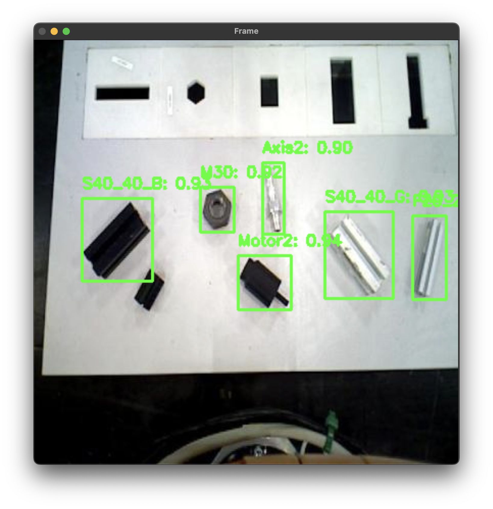

# GripNGrab

---

## Project Overview

**Task:**  
Develop an algorithm for **Object Detection**, **6DOF Pose Estimation**, and **Grasp Pose Extraction** for the RCUP@Work Objects Dataset.  

This project aims to enable robotic systems to detect objects, estimate their 6 Degrees of Freedom (6DOF) pose, and determine optimal grasp poses for manipulation tasks. The implementation is built from scratch using fundamental techniques, avoiding pre-built grasp detection solutions.

---

## How It Works

### Pipeline Overview

1. **Object Detection**  
   - Detect objects in the RCUP@Work dataset using deep convolutional neural network (CNN).  
   - Output: Bounding boxes for detected objects.

2. **6DOF Pose Estimation**  
   - Estimate the position (x, y, z) and orientation (roll, pitch, yaw) of the detected objects and (u,v) keypoints extracted.  
   - Output: A 6DOF pose for each object.

3. **Grasp Pose Extraction**  
   - Analyze the object's geometry and pose to compute optimal grasp points.  
   - Output: Grasp poses suitable for robotic manipulation.

---

### Mathematical Concepts

1. **Keypoint Detection**  
    - Utilizes a custom algorithm to extract corner points from object images, with fallback mechanisms for low keypoint scenarios.  
    - **Mathematics:**  
      - **Edge Detection:** Apply Gaussian blur to reduce noise and use Canny edge detection to identify edges.  
      - **Contour Approximation:** Filter contours by length and approximate them using the Douglas-Peucker algorithm to extract corner points.  
      - **Fallback Strategy:** Iteratively relax constraints (e.g., reduce contour length and approximation epsilon) to ensure at least 4 keypoints are detected.  
      - **Keypoint Selection:** Limit the number of keypoints to a maximum threshold (e.g., 10) for computational efficiency.  
    - **Algorithm Overview:**  
      ```python
      def extract_corner_points(image, min_contour_length=50, max_corners=10, epsilon_factor=0.02):
            # Step 1: Preprocess image (grayscale, blur, edge detection)
            # Step 2: Find and filter contours by length
            # Step 3: Approximate contours to extract corner points
            # Step 4: Apply fallback if fewer than 4 keypoints are found
            # Step 5: Limit keypoints to `max_corners` and visualize results
            return corner_points, edges
      ```  
    - **Output:**  
      - Extracted 2D corner keypoints (N, 2).  
      - Edge-detected image for visualization.  

2. **6DOF Pose Estimation**  
   - Relies on solving the Perspective-n-Point (PnP) problem.  
   - **Mathematics:**  
     - Camera projection model:  
       ```
       s * [u, v, 1]^T = K * [R | t] * [X, Y, Z, 1]^T
       ```
       Where `K` is the camera intrinsic matrix, `[R | t]` is the rotation and translation matrix, and `[X, Y, Z]` are 3D object points.

3. **Grasp Pose Extraction**  
- Computes grasp points based on object geometry and stability analysis.  
    - **Mathematics:**
      
      - Principal Component Analysis (PCA): Identify the object's major and minor axes from contour points.  
      - Grasp point selection: Choose two points along the minor axis, equidistant from the object's centroid.  
      

---

## Deliverables
**Visualizations**  
   - Images or videos demonstrating:  
     - Detected objects with bounding boxes.
       
     
     - Grasp points overlaid on objects.
     
     
     
     
     
     

     - Estimated 6DOF poses visualized as coordinate frames.
     
     


---

## Challenges and Improvements

### Current Challenge: 6DOF Pose Estimation Lagging  
**Reason:**  
- Incorrect keypoint detection due to the presence of a variety of objects with complex shapes.  

**Proposed Improvement:**  
- Implement a combined keypoint + bounding box detection neural network.  

**Why It Works:**  
- Every object's 2D keypoints can be detected and matched with its 3D points, enabling accurate Perspective-n-Point (PnP) solutions.  

**Limitation:**  
- The RCUP@Work dataset only provides bounding box annotations, not keypoints.  
- Creating a custom, well-performing model for all 18 objects would require significant time for annotation and training.  

**Impact:**  
- This limitation results in lower accuracy and robustness in 6DOF pose estimation.  

---  